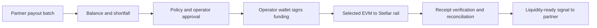

<p align="center">
  
</p>

# Flux

**Treasury planning and settlement control for Stellar payment operators.**

Flux is developing a treasury control layer that connects upcoming Stellar payout obligations to policy-controlled funding and reconciliation. The current sandbox calculates a batch's funding shortfall, applies treasury policy, requests operator approval, and reconciles simulated incoming funds before signaling that the batch has sufficient liquidity.

The intended outcome is **less continuously prefunded stablecoin inventory on Stellar while preserving the operator's payout SLA**.

> **Current stage: local sandbox prototype, preparing for SCF interest review.** The API, database and operator workflow are implemented. Balances, cross-chain transfers and payouts are simulated. Live wallet signing, transport, Stellar observation and payout-engine integration remain to be built. No production usage or measured capital savings are claimed.

**Current sandbox increment:** a read-only, time-based liquidity planner for multiple upcoming batches is now available alongside the existing funding lifecycle. It uses mock obligations and current sandbox balances; it never creates, approves or submits a funding request. The first live pilot remains limited to one validated asset route. See the [v1.4 product direction proposal](docs/PRODUCT_DIRECTION.md) for scope, validation criteria and delivery order.

[Product](#the-problem) · [Workflow](#how-flux-works) · [Scope](#first-live-mvp-scope) · [Status](#what-is-implemented) · [Run locally](#run-locally) · [Architecture](docs/ARCHITECTURE.md)

## The problem

Batch-based remittance, payroll and disbursement operators need enough settlement liquidity to start payments on time. Keeping a large stablecoin buffer on Stellar can tie up treasury capital, while replenishing that buffer from another network can require separate approvals, transfers, monitoring and manual reconciliation.

Flux ties those operations to the business event that creates the need: a scheduled payout batch. It answers how much funding is required, whether it is permitted, who authorized it, where it is in transit, and whether the correct funds are usable by the payout system.

The initial customer is an operator with all three characteristics:

- Meaningful Stellar stablecoin settlement inventory or recurring manual top-up work.
- Treasury liquidity available through a supported EVM stablecoin path.
- A batch schedule that accommodates measured funding time plus an agreed safety buffer.

These are validation hypotheses. Operator interviews and pilot data must establish that the problem exists and that this workflow improves it.

## How Flux works

The funding execution flow is:



1. **Receive the batch.** A partner sends a unique batch ID, required asset and amount, settlement account and scheduled start time.
2. **Calculate the need.** Flux reads confirmed usable balance, preserves the operating reserve and accounts for liquidity already allocated to other batches.
3. **Apply policy.** Source/destination restrictions, funding limits, balance freshness and timing determine whether funding may proceed.
4. **Approve and sign.** The operator approves the exact intent. In the live design, the operator's wallet or multisig signs the source transaction; treasury private keys remain outside Flux.
5. **Observe and reconcile.** Flux correlates the source transaction, rail evidence and Stellar receipt, checking the destination account, asset identity and amount.
6. **Signal readiness.** The partner receives a funding-ready event and remains responsible for starting and completing its payout workflow.

If delivery is ambiguous, the request enters `ATTENTION_REQUIRED`. Recovery follows the original transfer's evidence; a timeout does not authorize sending additional value.

### A funding example

```text
Batch liquidity need                 18,430
Minimum operating reserve             5,000
Other batch allocations                   0
Confirmed Stellar balance             5,200
                                     ------
Required top-up                       18,230
```

```text
top_up = max(0, batch_need + minimum_reserve + other_allocations - confirmed_balance)
```

After that top-up and the batch payout, the account retains the 5,000 reserve, assuming no other activity or fees. This is an illustrative calculation, not a pilot result. The sandbox uses exact decimal arithmetic and zero simulated fees; live funding must incorporate the selected route's quote and fee model.

## First live MVP scope

The implemented funding baseline is **Flux PRD v1.3, dated 6 September 2026**. The original document is maintained separately. The [v1.4 direction proposal](docs/PRODUCT_DIRECTION.md) adds obligation planning as the recommended next increment; it is not a completed feature or a replacement final PRD.

| Dimension          | Target for the first live MVP                                                                     |
| ------------------ | ------------------------------------------------------------------------------------------------- |
| Customer           | One pilot operator with a validated batch funding need                                            |
| Trigger            | One scheduled/batch payout workflow                                                               |
| Source             | One supported EVM chain and one operator-controlled treasury                                      |
| Asset and rail     | One route selected to match the operator's settlement asset                                       |
| Destination        | One operator-controlled Stellar settlement account                                                |
| Policy             | Minimum reserve, batch shortfall, hard caps, allowlists and timing checks                         |
| Authorization      | Manual operator or multisig approval for every mainnet funding transfer                           |
| Payout integration | One partner adapter; SDP is the proposed reference integration                                    |
| Evidence           | Batch → approved intent → source transaction → rail identifier → Stellar receipt → reconciliation |

**Rail selection remains an explicit decision.** LayerZero/USDT0 is the primary PRD candidate. CCTP/native USDC is the benchmark and fallback if it better fits the operator's settlement asset. Base is a preference only if the chosen route and operator treasury support it. The first live version selects one route; it does not implement a multi-rail router.

Official Stellar documentation describes both [USDT0 through LayerZero](https://developers.stellar.org/docs/tokens/usdt0-layerzero) and [native USDC through CCTP](https://developers.stellar.org/docs/tokens/cross-chain-transfers). Flux has not yet proven a selected source-to-destination route. Network support, asset identifiers, receivability and timing must be verified for that exact configuration.

### Product boundaries

Flux owns the funding decision, authorization workflow, transfer coordination and reconciliation evidence. The operator controls its treasury keys. The payout partner owns recipient onboarding, compliance, payout execution, local-fiat operations and payout retries.

Credit, lending, FX optimization, general-purpose bridging, yield, autonomous mainnet signing, reverse rebalancing and a custom custody vault are outside this MVP. Threshold replenishment, additional treasuries/rails and broader partner tooling are later phases. Flux targets Stellar-side stablecoin inventory; eliminating every form of prefunding is not a product claim.

## What is implemented

| Capability           | Repository today                                                            | Remaining live work                                                             |
| -------------------- | --------------------------------------------------------------------------- | ------------------------------------------------------------------------------- |
| Batch ingestion      | Validated API, unique batch/key checks, limited TypeScript client           | Real operator/SDP adapter and authenticated partner identity                    |
| Shortfall and policy | `BigInt` amounts, allocations, reserve, caps, expiry and freshness guard    | Real usable-balance observations and route-specific fees                        |
| Approval             | Exact-intent approval and separate sandbox submission                       | Named identity, MFA/RBAC and operator-controlled wallet signing                 |
| Transfer lifecycle   | Persistent success, delayed and mismatch simulations                        | Source transaction construction, broadcast recovery and rail observation        |
| Reconciliation       | Simulated source/message/receipt binding, receipt uniqueness and quarantine | Verified chain evidence and destination capability checks                       |
| Audit and callbacks  | Hash-linked audit, transactional outbox and HMAC webhook verifier           | External retention, production delivery operations and partner acknowledgements |
| Operator workspace   | Overview, funding requests, policy, activity/audit and integrations         | Pilot-specific operating experience and measured outcomes                       |
| Runtime              | One local Node process, persistent SQLite, browser/core/API tests           | Deployment identity, migrations, backup drills, monitoring and security review  |

The `sandbox:` addresses and `sim:` evidence are deliberately synthetic. `TransferEvidence` currently requires `simulated: true`. A production asset build changes frontend serving, not the execution mode.

The [architecture document](docs/ARCHITECTURE.md) defines the implemented boundaries, proposed live components, financial invariants, failure handling and PRD acceptance mapping.

## Run locally

Requires **Node.js 24+**, npm, and commands run from the repository root.

```sh
npm ci
npm run dev
```

Open **http://127.0.0.1:4337** for the product landing page, then select **Launch app** to enter the sandbox through a short, skippable intro. The operator workspace is also directly accessible at **http://127.0.0.1:4337/app**. Reduced-motion preferences skip the intro. The landing page uses illustrative data and does not open an operator session. Express serves the API and the Vite development application on the same origin. Development live reload also uses port 4338 by default.

First startup creates `backend/data/flux.sqlite` and three sandbox sample requests. State persists across restarts. Samples are seeded once per database and can expire; create a fresh request if the sample approval window has passed.

To use an empty, separate workspace, choose a database path that has not been used before:

```sh
FLUX_SEED=false FLUX_DB_PATH=backend/data/interest-demo.sqlite npm run dev
```

Preserve previous databases when they contain evidence you need. `FLUX_SEED=false` disables sample creation; it does not erase existing records.

To serve built frontend assets locally:

```sh
npm run build
npm start
```

Stop the development server before using the same port for `npm start`. `FLUX_MODE` accepts only `sandbox`; there is no live-mode configuration switch.

### Walk through the sandbox

1. Open **Contractor payroll** in a fresh seeded workspace and review the **18,230** top-up.
2. Select the approval checkbox, then **Approve funding**.
3. Select **Run sandbox transfer** and watch the recorded states. Successful simulation normally reconciles in approximately **7–9 seconds**; this is a simulator timer, not a cross-chain SLA.
4. **Export evidence** to inspect the request, policy snapshot, simulated transfer references and audit history.
5. **Simulate payout** to exercise the balance debit and retained reserve.
6. Create a **Delayed delivery** request. Once it needs attention, **Retry observation** follows the existing transfer; **Release sandbox delay** delivers that original simulation.
7. Create an **Amount mismatch** request to see reconciliation hold the payout and quarantine the partial receipt.

Pause blocks new funding creation, approval and submission. Observation continues, and an already funded sandbox payout can still be simulated. Funding pause and partner payout execution are separate controls.

## Configuration

An optional root `.env` is loaded at startup. Use [.env.example](.env.example) as the template; existing environment variables take precedence.

| Variable              | Default / purpose                                                   |
| --------------------- | ------------------------------------------------------------------- |
| `PORT`                | `4337`; HTTP listens on `127.0.0.1`                                 |
| `FLUX_DB_PATH`        | `backend/data/flux.sqlite`                                          |
| `FLUX_MODE`           | `sandbox`; other values are rejected                                |
| `FLUX_SEED`           | Set `false` to disable sample creation                              |
| `FLUX_API_TOKEN`      | Optional fixed partner bearer token, at least 32 characters         |
| `FLUX_WEBHOOK_SECRET` | Optional fixed HMAC secret, at least 32 characters                  |
| `FLUX_WEBHOOK_URL`    | Optional operator-configured HTTPS receiver; redirects are rejected |

Without configured secrets, random API and webhook secrets are generated and persisted in the local database. Operator sessions use a separate process-local token carried by an HttpOnly/SameSite cookie or an in-memory header for embedded previews. Partner bearer credentials cannot approve, submit, cancel, edit policy or invoke sandbox payout controls.

The session bootstrap trusts local access. It does not identify individual operators or implement production login/MFA. Keep the treasury workspace local; a public product page or demo recording can be shared separately. Secrets, database files and private operator data must remain outside published evidence.

## Development and verification

| Command                | Purpose                                                         |
| ---------------------- | --------------------------------------------------------------- |
| `npm run dev`          | Local API, simulator worker and frontend development server     |
| `npm run typecheck`    | TypeScript validation across backend, frontend and shared code  |
| `npm test`             | Core, API and runtime safety tests                              |
| `npm run build`        | Typecheck and build frontend assets into `frontend/dist/client` |
| `npm run check`        | Typecheck, backend tests and build; excludes browser tests      |
| `npm run test:e2e`     | Chrome browser journeys using an isolated temporary database    |
| `npm run format:check` | Repository formatting check                                     |

Browser tests use locally installed Google Chrome, port **4328** and development live-reload port **4329**. CI installs Chrome before running them. Screenshots and failure artifacts are written to `test-results/` when produced by the tests. See [CI configuration](.github/workflows/ci.yml).

Test coverage includes monetary precision, caps, approval binding, idempotency, expiry, allocations, pause, delayed/partial delivery, audit rollback and restart recovery. These tests exercise the sandbox. Live chain finality, wallet behavior, transport outages and real partner integration need additional acceptance evidence.

## Repository map

```text
shared/                       API types and exact monetary arithmetic
backend/src/app.ts            HTTP routes, validation and local access controls
backend/src/service.ts        Funding policy, lifecycle, reconciliation and metrics
backend/src/store.ts          SQLite persistence, audit and outbox storage
backend/src/index.ts          Configuration, serving and worker lifecycle
backend/src/adapters/         Persistent sandbox transport
backend/src/sdk/              Limited integration client and webhook verification
backend/tests/                Core, API and runtime tests
frontend/src/                 React operator workspace and styles
frontend/tests/browser/       Desktop, mobile and embedded browser journeys
docs/                         Architecture, operations, acceptance and preparation
```

## Validation and delivery path

| Stage                                | Evidence to produce                                                                                                   |
| ------------------------------------ | --------------------------------------------------------------------------------------------------------------------- |
| Interest preparation — current focus | Reproducible sandbox demo, clear architecture, accurate implementation status and verifiable founder background       |
| Operator and route validation        | Quantified inventory/top-up need, pilot agreement, selected asset/chain/signing method and route feasibility evidence |
| Deterministic live funding           | One approved intent correlated to source transaction, rail identifier and usable Stellar receipt                      |
| Failure-safe integration             | Recovery and restart tests, negative cases, authenticated partner readiness and payout-status linkage                 |
| Controlled pilot                     | Exposure caps, operational/security sign-off, repeated real batches and measured inventory/SLA outcomes               |

The pilot should compare average settlement inventory against an agreed baseline, while reporting payout SLA adherence, repeated funded batches, external-to-Stellar volume, p50/p95 funding time and manual interventions. Simulation volume and self-generated test transfers must remain separate from operator usage.

SCF Integration Track is the intended application path, subject to eligibility review. Its published guidance expects existing traction and starts with an interest form before a Build invitation. Interest preparation and the PRD's full pilot/mainnet acceptance gates are distinct milestones. [SCF Integration Track guidance](https://stellar.gitbook.io/scf-handbook/scf-awards/build-award/integration-track)

## Further reading

- [Architecture and technical decisions](docs/ARCHITECTURE.md) — system boundaries, invariants, live design and PRD traceability.
- [API and operations](docs/API_AND_OPERATIONS.md) — current endpoints, webhook contract and sandbox recovery.
- [Acceptance and pilot gates](docs/ACCEPTANCE.md) — recorded validation results and outstanding live acceptance evidence.
- [Sandbox build plan](docs/MVP_BUILD_PLAN.md) — implementation history and local delivery decisions.

Flux is a working product name. No operator partnership, SCF award or protocol endorsement is implied by the proposed integrations.
