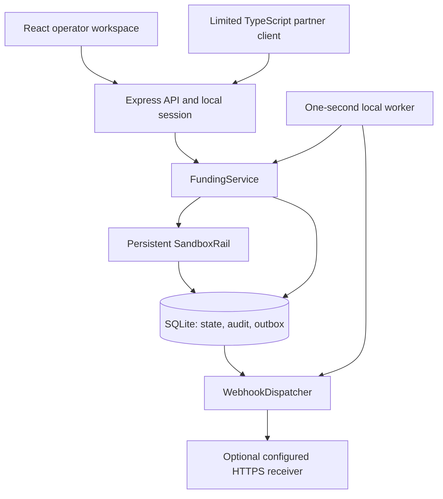
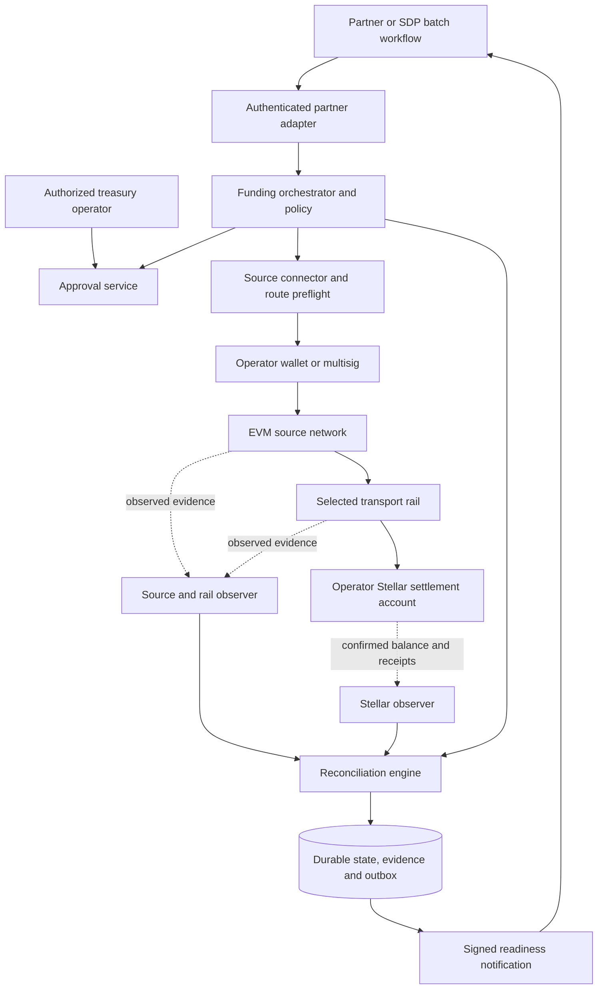
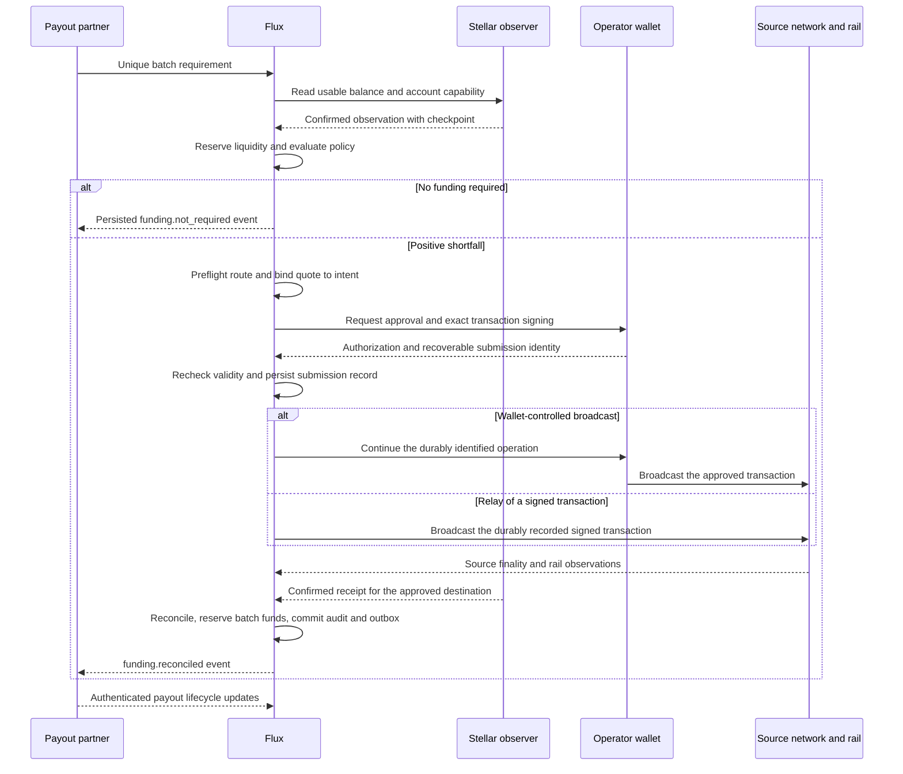
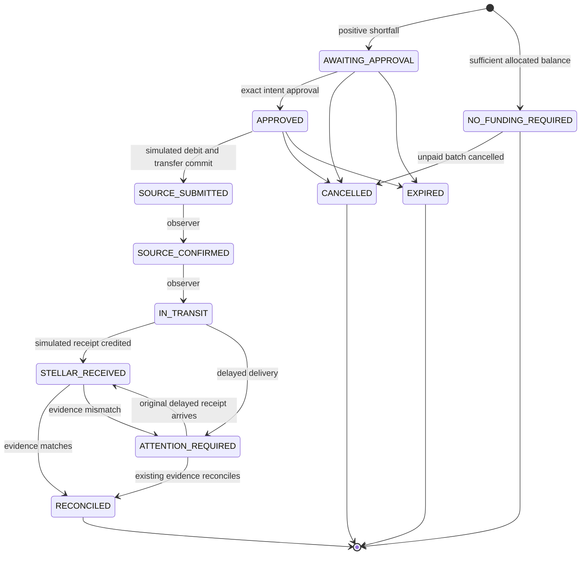

# Flux architecture

**Product baseline:** Flux PRD v1.3, 6 September 2026. **Architecture review:** 7 September 2026.

Flux coordinates funding for a Stellar payout batch from an operator-controlled external treasury. Its core responsibility is to preserve the relationship between the business need, the approved funding amount, the transfer evidence and the resulting usable settlement balance.

This document describes both the repository as implemented and the design required for a live pilot. **Only the local sandbox is implemented.** A proposed component, interface or control below is not evidence of a deployed integration.

| Status label     | Meaning                                                                                         |
| ---------------- | ----------------------------------------------------------------------------------------------- |
| Implemented      | Present in the repository; external financial activity is still simulated                       |
| Live requirement | Required by the PRD or by the proposed live design; implementation/evidence remains outstanding |
| Open decision    | Must be resolved for the selected operator, route or deployment                                 |
| Deferred         | Outside the first live MVP                                                                      |

The PRD governs product intent. Code determines current behavior. Differences are documented explicitly rather than treating the sandbox as the complete PRD implementation. Test results belong in [ACCEPTANCE.md](ACCEPTANCE.md); writing this document does not revalidate historical test results.

[Boundaries](#1-system-boundaries) · [Current system](#2-implemented-sandbox) · [Live design](#3-target-live-architecture) · [Money and policy](#4-financial-invariants-and-policy) · [Lifecycle](#6-lifecycle-and-recovery) · [Security](#9-security-and-trust-boundaries) · [Decisions](#12-architecture-decisions) · [PRD mapping](#13-prd-traceability-and-delivery-gates)

## 1. System boundaries

The first live deployment serves **one operator, one supported EVM source chain, one stablecoin route, one Stellar settlement account and one batch integration**. A modular service is sufficient for this scope; separate logical responsibilities do not require microservices.

| Actor or system                  | Owns                                                                                             | Boundary                                                                    |
| -------------------------------- | ------------------------------------------------------------------------------------------------ | --------------------------------------------------------------------------- |
| Payout partner                   | Batch contents, recipients, scheduling, payout execution and business status                     | Sends the funding requirement; decides whether/when to execute payments     |
| Treasury operator                | Treasury funds, source wallet/multisig, reserve policy and approvals                             | Authorizes the exact economic action; keeps treasury keys outside Flux      |
| Flux                             | Shortfall, policy evaluation, funding lifecycle, evidence correlation and readiness notification | Coordinates funding; cannot promise external transport or payout completion |
| Source network and selected rail | Transaction inclusion/finality and cross-chain delivery                                          | External systems observed through route-specific evidence                   |
| Stellar settlement account       | Operator-owned destination inventory                                                             | Receives the selected usable asset; no Flux custody vault is assumed        |

Credit, local-fiat float, FX, recipient onboarding, KYC/KYB and compliance remain outside the Flux funding service. A future integration with an anchor or payout provider would need its own scope and trust review.

**Funding success and payout success are different facts.** A reconciled top-up may remain successful even if the partner later cancels or fails its batch. Excess funds remain the operator's inventory; automatic reverse transfers are deferred.

## 2. Implemented sandbox

### Runtime and components



All components except the optional receiver run in one Node process. The worker advances simulated transfers; it does not poll a blockchain. React polls `/api/v1/overview` every two seconds. Development uses Vite middleware; production asset serving uses `frontend/dist/client`. Both execution paths remain sandbox-only.

| Module                                                          | Implemented responsibility                                                                             |
| --------------------------------------------------------------- | ------------------------------------------------------------------------------------------------------ |
| [app.ts](../backend/src/app.ts)                                 | JSON API, Zod input validation, host/origin checks, local operator/partner access separation           |
| [service.ts](../backend/src/service.ts)                         | Shortfall, allocations, approvals, caps, state transitions, reconciliation, sandbox payout and metrics |
| [store.ts](../backend/src/store.ts)                             | SQLite transactions, request persistence, audit hash chain, outbox and balance history                 |
| [sandbox.ts](../backend/src/adapters/sandbox.ts)                | One persisted simulated transfer per request, delayed delivery and partial receipt generation          |
| [webhooks.ts](../backend/src/webhooks.ts)                       | One dispatcher, delivery attempts and exponential retry backoff                                        |
| [sdk/client.ts](../backend/src/sdk/client.ts)                   | Create, get and retry-observation client methods                                                       |
| [sdk/webhooks.ts](../backend/src/sdk/webhooks.ts)               | HMAC signing and timestamp/signature verification                                                      |
| [money.ts](../shared/money.ts) / [types.ts](../shared/types.ts) | Exact amounts and shared API/state contracts                                                           |
| [App.tsx](../frontend/src/App.tsx)                              | Operator screens, session bootstrap, polling and actions                                               |

The service constructs `SandboxRail` directly. There is no interchangeable live rail interface, wallet connector, real Stellar observer or SDP adapter yet. Current types deliberately constrain `mode` to `sandbox` and evidence to `simulated: true`.

### Persistence and transaction boundaries

`Store` uses Node's `node:sqlite`, WAL, `synchronous = FULL`, foreign keys, a five-second busy timeout and `BEGIN IMMEDIATE` for service mutations. The database file is set to mode `0600`; newly created parent directories request `0700` permissions.

| Table               | Stored data / constraint                                                                     |
| ------------------- | -------------------------------------------------------------------------------------------- |
| `config`            | JSON policy, settlement account, source treasury, seed marker and local integration secrets  |
| `funding_requests`  | Mutable request JSON; unique request ID, batch ID and idempotency key; normalized input hash |
| `transfers`         | Simulated transfer JSON, unique by funding request ID                                        |
| `consumed_receipts` | Unique receipt ID and unique funding request binding                                         |
| `audit_events`      | Sequenced JSON events; UPDATE/DELETE rejected by triggers                                    |
| `outbox`            | Stable event ID, payload and mutable delivery metadata                                       |
| `balance_history`   | Recorded simulated balance changes                                                           |

Creation commits the request, audit and outbox together. Simulated submission also commits the treasury debit and transfer insertion in the same database transaction. Receipt credit and reconciliation changes are transactional. Payout debits and allocation release commit together. An audit/outbox failure rolls back the surrounding mutation.

These guarantees apply inside one local database. An external broadcast or HTTP delivery cannot join that transaction. The live design must address those boundaries explicitly.

Queries frequently load all requests or outbox records and filter in memory. Per-request audit lookup scans the audit table. This is a small-workspace implementation with no pagination, migration system, worker leases or multi-instance support. Before a hosted pilot, introduce indexed queries, versioned migrations and measured storage/worker capacity; PostgreSQL is an option to evaluate, not a dependency already selected.

## 3. Target live architecture

**Live requirement / proposed decomposition.** Keep policy and business lifecycle independent of protocol details. Implement only the selected rail, while keeping its evidence contract explicit enough to avoid changing the product model for each protocol.



Arrows into the wallet represent transaction preparation and operator authorization, not treasury-key access by Flux. The wallet integration may broadcast itself or permit relaying an already signed transaction; its exact persistence and recovery contract is an open decision.

### Proposed integration contracts

These are responsibilities to implement, not current exported SDK methods.

| Boundary                | Input                                            | Required output / behavior                                                                                   |
| ----------------------- | ------------------------------------------------ | ------------------------------------------------------------------------------------------------------------ |
| Partner adapter         | Authenticated partner and versioned batch event  | Normalized need, stable business identity, schedule, asset and cancellation/status linkage                   |
| Balance observer        | Pinned network, account and asset                | Confirmed usable balance, ledger/checkpoint, observation time and freshness assessment                       |
| Route preflight / quote | Funding need and approved route configuration    | Source debit, destination minimum receipt, fees, allowance/gas requirements, expiry and receivability result |
| Source connector        | Approved intent and valid quote                  | Exact transaction/signing payload bound to chain, token, destination and economic limits                     |
| Signing integration     | Operator-visible transaction                     | Wallet/multisig authorization reference and recoverable transaction identity; no private key returned        |
| Source/rail observer    | Durable submission reference                     | Inclusion/finality evidence, protocol identifier and delivery observations                                   |
| Reconciliation engine   | Intent, source/rail evidence and Stellar receipt | Verified outcome, explicit mismatch/ambiguity or continued observation                                       |
| Partner notification    | Committed readiness event                        | Authenticated delivery with retries; partner deduplication and independent business status                   |

### Target happy path



The sequence is a target contract. In particular, wallet-driven broadcast must not be treated as recoverable merely because the wallet returns a transaction hash after sending. Its crash window must be resolved as described in section 7.

### Route selection and asset identity

| Candidate          | Selection rationale                                           | Proof still required                                                                                                       |
| ------------------ | ------------------------------------------------------------- | -------------------------------------------------------------------------------------------------------------------------- |
| LayerZero / USDT0  | Primary PRD candidate where treasury and settlement asset fit | Supported source deployment, token/allowance flow, destination capability, message correlation, fees and measured delivery |
| CCTP / native USDC | Benchmark/fallback where the operator settles in USDC         | Supported source and Stellar configuration, attestation/receipt correlation, fees and measured delivery                    |

USDT0 on Stellar is a classic asset with a Stellar Asset Contract. Identity includes issuer, not only the asset code. Stellar uses seven decimal places and the documented USDT0 OFT path uses six shared decimals. Pin and verify the deployment configuration before use. [Official USDT0 integration and precision documentation](https://developers.stellar.org/docs/tokens/usdt0-layerzero)

CCTP supports native USDC transfers involving Stellar; exact supported chains and deployment configuration must be checked through the official route documentation. [Official Stellar CCTP entry point](https://developers.stellar.org/docs/tokens/cross-chain-transfers)

For either route, record the network/environment, source chain ID, source token/contract, route identifiers, destination asset issuer/contract, approved account, precision, fee model, finality rule and verification date. Do not copy mainnet addresses into a test environment or infer route support from an ecosystem listing. A mock token test must be labeled separately from evidence for the intended production asset.

No source chain is selected in this repository. Base is conditional. Do not introduce an unvalidated USDT0-to-USDC conversion to preserve a preferred protocol narrative. A receiver/vault contract is deferred unless an operator requirement justifies the additional custody and recovery surface.

## 4. Financial invariants and policy

The following are architectural acceptance conditions. Current enforcement is described alongside live gaps; a product invariant is not a claim that every live threat is already handled.

| ID     | Invariant                                                                              | Current enforcement / live gap                                                                                            |
| ------ | -------------------------------------------------------------------------------------- | ------------------------------------------------------------------------------------------------------------------------- |
| INV-01 | One business funding attempt cannot silently create duplicate economic transfers       | Unique batch/key and simulated transfer constraints; external signing/broadcast recovery remains outstanding              |
| INV-02 | Funding decisions use exact amounts and fresh confirmed usable liquidity               | Decimal strings/`BigInt`, 15-second guard and allocation accounting; balances are simulated                               |
| INV-03 | Approval is bound to the exact intent and expiry                                       | Stored hash and approval equality; live signing payload and route/fee binding still required                              |
| INV-04 | Hard transfer/daily caps cannot be bypassed by approval or concurrency                 | Transactional reservations and submit-time checks; live signer/administrative controls still required                     |
| INV-05 | Treasury private keys remain outside Flux                                              | No key ingestion or signer exists; preserve this boundary when implementing wallets                                       |
| INV-06 | Ambiguous transfers stay observable without an additional economic send                | Observation-only recovery in sandbox; selected protocol recovery needs separate proof                                     |
| INV-07 | Payout readiness requires sufficient allocated liquidity and verified funding evidence | Zero-need/reconciled readiness and quarantine; chain receipts and partner release controls remain outstanding             |
| INV-08 | Receipt credit and consumption cannot be duplicated                                    | Persisted credited flag and receipt uniqueness; live receipt identifiers must include the correct network/operation scope |
| INV-09 | Material state changes preserve audit and notification intent                          | Transactional audit/outbox; external durability and named identity are live requirements                                  |
| INV-10 | Business payout failure cannot rewrite funding success                                 | Separate funding/payout fields; authenticated partner status ingestion remains outstanding                                |

### Exact amounts and allocation

The PRD's single-batch formula is extended for concurrent reservations:

```text
B = confirmed settlement balance
R = minimum operating reserve
N = this batch's required liquidity
A = allocations held by other unpaid, uncancelled requests

raw_shortfall = max(0, N + R + A - B)
funding_amount = round_up_to_selected_route_precision(raw_shortfall)
initial_batch_allocation = min(N, max(0, B - R - A))
```

The current simulator rounds funding upward to six decimal places and performs all funding decisions using seven-decimal integer units. Approval display preserves sub-cent values. Overview display formatting is not an accounting input.

An unsubmitted request reserves the currently available contribution to its batch. Incoming unconfirmed funding is excluded from available balance. When a simulated receipt is credited, its amount is added to the request's allocation, quarantining the receipt until reconciliation. A successful reconciliation replaces that allocation with the full batch need. Partial/mismatched delivery stays held. A simulated payout checks that the remaining balance covers the current reserve and every other allocation before debiting and releasing its own allocation.

In a live account, external withdrawals and payouts can change balance outside Flux. Internal reservations do not lock onchain funds. The operator integration must define account-spending coordination and recheck readiness before payout execution; otherwise the reserve/SLA claim is unsupported.

### Caps, expiry and pause

The current daily cap is based on UTC. Unsubmitted, unreleased requests remain committed even across midnight. Submitted funding counts on its UTC submission day. Cancelled/expired unsubmitted requests release their reservations; a transfer in transit is not released merely because it is delayed. Source treasury capacity also accounts for outstanding unsubmitted funding.

Creation enforces the minimum lead time; creation/approval/submission enforce pause and balance freshness. The normal sandbox worker refreshes the simulated account's observation timestamp every second. That demonstrates the lifecycle guard, not a real RPC freshness check.

Submission rechecks expiry, current hard caps, source balance and funding sufficiency. An increased shortfall requires a new approved attempt; the approved amount is not increased in place. A smaller shortfall does not automatically reduce an already approved amount.

All positive sandbox funding requires manual approval. The PRD's approval threshold does not authorize autonomous mainnet funding: the first mainnet pilot requires operator approval for every transfer. Delegated automation and configurable approval thresholds are deferred. Hard caps remain hard limits regardless of approval.

Pause blocks new create/approve/submit actions while observation and reconciliation continue. Cancellation of an unsubmitted request remains available. Partner payout pause is a separate responsibility.

### Live quote requirements

The sandbox has zero fees. A live quote must separately expose source token debit, expected/minimum destination credit, gas currency and budget, transport fees, allowance spender/amount, precision and validity window. The funding calculation must target sufficient usable destination liquidity after fees; rounding alone is insufficient.

The approved record must bind these economic limits. A changed recipient, token, chain, payload or increased authorized debit requires renewed approval. Quote expiry and the final pre-submit checks must be specified for the chosen wallet flow; an offchain expiry cannot prevent a previously signed transaction from later being broadcast unless the execution path enforces it.

Before submission, validate source token balance and allowance, fee funding, destination asset authorization, account/trustline capacity and the reserve needed to receive and use the asset. Define “usable balance” for the selected account model, including liabilities or other restrictions that make nominal holdings unavailable. A variance tolerance must never release a batch whose usable funding is below its required minimum. The Stellar preflight should build on the [official trustline verification guidance](https://developers.stellar.org/docs/build/guides/basics/verify-trustlines).

## 5. Data model and approval binding

### Current model

[shared/types.ts](../shared/types.ts) is the executable API contract. `FundingRequest` contains both intended business terms and mutable lifecycle state. Approval records store actor, timestamp and intent hash; evidence is optional until simulation submission. Policy/account/treasury are single-workspace JSON configuration rather than separate operator tables.

The current intent hash is SHA-256 over a JSON object constructed from:

- Request ID, partner batch ID and required batch liquidity.
- Calculated top-up and source treasury address.
- Destination account ID/address, asset and issuer.
- Request expiry and policy snapshot.

It does **not** yet bind a source chain ID/token contract, quote, fee ceiling, nonce or encoded wallet transaction. It is an application-level approval reference, not an operator cryptographic signature. The request JSON remains database-mutable; a database owner is outside this protection boundary.

Before simulated submission, the service compares destination address/asset/issuer and source address with current configuration. A live implementation must extend this to the complete network, asset, route and signing domain.

### Proposed live records

| Record                 | Additional information required                                                                                                                                        |
| ---------------------- | ---------------------------------------------------------------------------------------------------------------------------------------------------------------------- |
| `FundingIntent`        | Versioned canonical payload, operator/partner scope, batch revision and schedule, networks/assets, amount limits, destination, expiry and policy/route snapshot        |
| `BalanceObservation`   | Account/asset, usable amount, observation source, ledger/checkpoint, observed time and freshness result                                                                |
| `RouteQuote`           | Quote identity, source debit, destination limits, gas/transport fees, spender/allowance, expiration and configuration version                                          |
| `Approval`             | Authenticated approver, exact intent digest, decision, method and wallet/multisig authorization reference                                                              |
| `SubmissionAttempt`    | Durable attempt ID, signer/nonce or multisig operation identity, approved payload digest, expected transaction identity, broadcast uncertainty and replacement lineage |
| `TransferEvidence`     | Network-scoped source transaction/finality, rail identifier, destination transaction/operation, asset/account/amount and observation provenance                        |
| `ReconciliationRecord` | Expected versus observed terms, variance decision, consumed receipt identity and correlated evidence                                                                   |
| `PayoutBatchRef`       | Partner identity, batch revision and authenticated business lifecycle distinct from funding state                                                                      |

Define canonical serialization and signing-domain separation before implementing live approval. Monetary values remain exact strings/integers. A source transaction and a destination transaction alone are insufficient correlation; the route-specific evidence must bind them to the same approved transfer.

## 6. Lifecycle and recovery

### Implemented funding state machine



`NO_FUNDING_REQUIRED` ends funding work immediately; cancellation remains possible while its batch is unpaid. `RECONCILED` ends funding observation. Business payout state is separately `HELD`, `READY`, `PAID` or `CANCELLED`. The attention-to-reconciled path requires matching evidence; there is no operator “mark successful” override or general mismatch-repair endpoint.

| Transition boundary            | Required condition                                                                               |
| ------------------------------ | ------------------------------------------------------------------------------------------------ |
| Create → approval/zero funding | Valid unique input, active policy, fresh balance, lead time, capacity and caps                   |
| Awaiting → approved            | Exact stored hash, unexpired request and operator API permission                                 |
| Approved → submitted           | Matching approval, pre-submit revalidation and unique simulated transfer                         |
| Receipt → reconciled           | Source/message/receipt/account/asset/issuer/amount match and receipt not used by another request |
| Ready → simulated payout       | Fresh balance and sufficient funds after preserving reserve/other allocations                    |
| Pending → expired              | Only awaiting/approved requests with no submission; worker releases allocation                   |
| Request → cancelled            | No submitted transfer, paid payout or already expired request                                    |

### Differences from the PRD diagram

`DETECTED` and `POLICY_EVALUATED` are synchronous creation steps rather than persisted states. Rejected policy evaluations return API errors without creating a request. The sandbox adds `APPROVED`, `NO_FUNDING_REQUIRED` and `EXPIRED` to make authorization and no-send outcomes explicit. `CLOSED` is not persisted; funding completion is `RECONCILED`, while business completion is tracked separately.

A live implementation also needs durable preparation/signing/submission-attempt state. Whether this becomes additional public funding states or a separate execution substate is an open decision. Unknown broadcast outcome must be representable before any confirmed hash is available; it must never be collapsed into “safe to send again.”

### Failure behavior

| Failure                                              | Required response                                                             | Repository today                                                                            |
| ---------------------------------------------------- | ----------------------------------------------------------------------------- | ------------------------------------------------------------------------------------------- |
| Duplicate batch/API input                            | Return existing identical request; reject changed payload                     | Implemented; normalized input hash and unique constraints                                   |
| Stale/unknown balance                                | Block funding decision and raise an operational exception                     | Age guard implemented; RPC outage handling absent                                           |
| Allowance/gas shortage or destination cannot receive | Reject preflight before signing/sending                                       | Live requirement                                                                            |
| Rejected or expired approval                         | No new submission; retain evidence and release safe reservations              | Cancellation/expiry implemented; named wallet rejection absent                              |
| Source revert or uncertain broadcast                 | Recover the existing attempt; prove failure before another economic attempt   | Live requirement; simulator has no real revert/broadcast boundary                           |
| Delayed delivery                                     | Hold readiness, enter attention, observe original transfer                    | Implemented simulation                                                                      |
| Partial/wrong receipt                                | Hold readiness and quarantine ambiguous credited value                        | Implemented simulation; live evidence resolution absent                                     |
| Destination received, callback unavailable           | Preserve funding success and retry notification                               | Transactional outbox implemented                                                            |
| Batch cancelled while funds are in transit           | Continue funding observation; record cancellation/excess inventory separately | Live partner lifecycle requirement; funding cancellation is currently rejected after submit |
| Partner payout fails after funding                   | Keep funding success, let partner handle payout retry                         | Separate states exist; real failure/status callback absent                                  |
| Restart during transfer                              | Resume from durable evidence without another economic debit                   | Implemented for simulator; live crash matrix still required                                 |
| Pause during transit                                 | Continue observation, prohibit new funding                                    | Implemented                                                                                 |

## 7. Idempotency and external execution

### Business identity

The sandbox normalizes accepted input and hashes it. Replaying the same normalized payload returns the existing request. Reusing either batch ID or idempotency key with different data is a conflict.

Uniqueness currently lasts for the entire database history, including cancelled and expired requests. A fresh business attempt therefore needs an explicit new batch revision/identifier after the previous attempt is confirmed safe to replace. Never generate a new identity to bypass ambiguity in a submitted transfer. A live partner contract must preserve the original business batch and revision lineage instead of relying on ad hoc new IDs.

### Database atomicity does not make broadcasting atomic

**Proposed live execution contract:**

1. Persist the intent, reservations, approval and a unique execution attempt before initiating an external send.
2. Establish a recoverable signing identity: source chain, signer, nonce or wallet operation reference, approved payload and expected transaction identity where available.
3. For relayed signed transactions, durably record the signed transaction identity before broadcasting. Protect signed material as sensitive execution data even though it is not a private key.
4. If the wallet broadcasts itself, require an intent-correlated, recoverable operation reference before sending, or document another proven reconciliation mechanism. Returning a hash only after broadcast leaves an unresolved crash window.
5. On restart or timeout, inspect that existing operation/transaction. Where protocol-safe, rebroadcasting the exact same signed transaction is different from creating a new value transfer.
6. Track nonce replacements and enforce the approved economic terms. Do not generate a fresh nonce or new economic instruction solely because an RPC call failed.
7. Keep ambiguous attempts reserved and under observation until source/rail/destination evidence supports a resolution.

An execution claim/lease must prevent two workers from preparing independent sends. Lease expiry alone cannot authorize a new economic attempt. This design must be exercised with failures before signing, after signing, during broadcast, after broadcast but before local acknowledgement, and during replacement/finality observation.

### Evidence and balance credit

A receipt must have a stable network-scoped identity fine-grained enough to distinguish relevant operations/events within a transaction. Live balance observations and receipt accounting need a shared checkpoint so the same transfer is not counted once through a refreshed balance and again through manual crediting.

The simulator increments a stored balance and uses a persistent `credited` flag. A live observer must replace that model with a defined ledger reconciliation strategy; copying the simulator's balance increment onto a live account snapshot would be unsafe.

## 8. API, partner integration and events

Current route details and request examples live in [API_AND_OPERATIONS.md](API_AND_OPERATIONS.md). The implemented base is `/api/v1`; the PRD's `/v1` examples describe the logical API. `/api/session` and `/health` are local runtime endpoints. The PRD's `POST /v1/webhooks/test` is not implemented.

The limited TypeScript client accepts the server origin as `baseUrl` and adds `/api/v1`. It supports create, get and observation retry. Operator approval/submission remain separate privileged operations. `scenario` and `/sandbox/*` controls belong only to simulation and must not enter a live partner API.

The real partner adapter must authenticate event origin, map a batch revision to one funding attempt, check the asset/account mapping, consume readiness idempotently and return business status. SDP is a proposed reference adapter, not a dependency already integrated. Its disbursement API provides the partner-side batch lifecycle to map against. [SDP disbursement API](https://developers.stellar.org/docs/platforms/stellar-disbursement-platform/api-reference/disbursements)

For an SDP reference implementation, the proposed handoff is:

1. Read the prepared disbursement's identity, amounts and asset while it is held before payment initiation.
2. Create the corresponding Flux funding attempt and retain the SDP disbursement ID and revision linkage.
3. After reconciliation or a no-funding result, have the authorized partner integration recheck batch validity and usable liquidity before triggering the partner's payout transition.
4. Read subsequent payment/disbursement outcomes into the separate business record. Repeated readiness events must not trigger duplicate partner actions.

SDP's `draft` to `ready` transition can start payments, so the adapter must treat that transition as an explicit partner-side action after the funding condition is satisfied. The partner's own pause, permissions and receiver prerequisites still apply. [SDP lifecycle reference](https://developers.stellar.org/docs/platforms/stellar-disbursement-platform/api-reference/disbursements)

### Outbox delivery

State transitions recorded through `record()` emit an outbox event inside the same transaction as the request and audit. Global policy/pause changes are audited separately. An HTTP response or callback failure must not erase a committed funding outcome.

The current dispatcher sends up to five eligible events per tick, sequentially, with a five-second HTTP timeout. One in-memory running flag prevents overlapping dispatch in the local process. HTTPS is required, redirects are rejected and retries back off to a one-hour maximum. Without a configured URL, events remain persisted but undelivered.

```text
X-Flux-Event-Id: stable ID across attempts
X-Flux-Timestamp: Unix seconds for this attempt
X-Flux-Signature: HMAC-SHA256(secret, timestamp + "." + exact raw JSON body)
```

The verifier checks signature format and a five-minute timestamp window. Receivers must also persist event-ID deduplication; a valid recent signature does not prevent repeated application of the same event. Delivery is at least once. Receivers must tolerate retry/out-of-order arrival and query authoritative request status when needed. `funding.reconciled` and `funding.not_required` indicate liquidity readiness, not completed partner payouts.

Production delivery needs worker claims, observable backlog/age, secret rotation and a documented treatment of permanently failing endpoints. Payout authorization must remain partner-owned even when webhook delivery succeeds.

## 9. Security and trust boundaries

### Current local controls

The server binds to loopback and checks Host/Origin. State-changing API calls require JSON. Browser sessions use a random process-local token through an HttpOnly/SameSite cookie or an in-memory `X-Flux-Session` header. The bootstrap has no-store caching and permits trusted local access. Frame policy accommodates local/editor previews.

Partner bearer credentials and operator sessions have different route permissions. This is a local role split, not individual operator authentication, MFA or tenant isolation. All browser operators share the local identity. In particular, `/integrations/:partner/events` currently takes its audit partner label from the URL; a live adapter must bind that identity to authenticated credentials.

API/webhook secrets are persisted in the SQLite configuration when not explicitly supplied. They are not treasury keys. Managed secret storage, rotation/revocation and production session controls remain outstanding.

### Required before controlled mainnet funding

| Trust surface             | Required control / acceptance evidence                                                                                                |
| ------------------------- | ------------------------------------------------------------------------------------------------------------------------------------- |
| Operator identity         | Named authentication, MFA, least-privilege roles and audited approvals                                                                |
| Source wallet             | Operator-controlled signing; independent visibility of chain, recipient, asset and amount/fees                                        |
| Configuration changes     | Authenticated source/destination allowlists, change audit, delayed activation of high-risk changes and reapproval of affected intents |
| Backend compromise        | Wallet/multisig or independent execution policy must constrain what a compromised backend can persuade the operator to sign           |
| Asset/account correctness | Pinned network and asset identity; destination capability/trustline preflight; exact receipt correlation                              |
| External observations     | Provenance/checkpoints, freshness/finality rules, disagreement handling and additional observation sources where practical            |
| Duplicate execution       | Durable submission identity, economic reservations, crash/replacement tests and no blind retry                                        |
| Audit durability          | External retention/backup, access controls and verifiable recovery of funding evidence                                                |
| Deployment                | Managed secrets, environment separation, exposure caps, monitoring and restore drills                                                 |

The local audit chain and triggers protect against ordinary row alteration through application/database operations. A database administrator can replace the database or its protections; no externally anchored immutability is implemented. The current hash scheme is not a substitute for operator signing or production key policy.

High-risk architecture changes need a recorded decision and accountable human approval. Mainnet exposure increases require the designated security and pilot owners' approval, with ownership established before the pilot. Independent review is required before material volume expansion. AI-assisted development does not replace these accountable roles.

## 10. Observability, operations and measurement

### Required evidence chain

```text
partner identity + batch revision
  → funding request and policy snapshot
  → named approval + signing reference
  → source transaction and finality evidence
  → rail-specific identifier / attestation
  → Stellar transaction / operation and usable asset receipt
  → reconciliation decision
  → partner batch status
```

Keep request/attempt/event identifiers in structured logs and metrics without exposing secrets or unapproved operator details. Operator views should surface stage age, last successful observation, pending amount, available balance, policy version, callback backlog and the evidence behind every attention state.

### PRD operational targets

These are **pilot targets, not measured service guarantees**.

| Measure                  | PRD target                                                             | Evidence required                                                           |
| ------------------------ | ---------------------------------------------------------------------- | --------------------------------------------------------------------------- |
| Availability             | At least 99.5% monthly during pilot                                    | Monitoring and incident accounting                                          |
| Batch event processing   | At most 5 seconds p95                                                  | Timestamped ingestion traces under expected load                            |
| Balance freshness        | At most 15 seconds at decision time unless explicitly agreed otherwise | Real observer timestamps/checkpoints and submit-time recheck                |
| Critical ambiguity alert | Within 60 seconds of state trigger                                     | Alert delivery drill                                                        |
| Funding lead time        | Measure p50/p95 for selected route; no promised value yet              | Correlated detection-to-usable-funds timestamps                             |
| Operational metadata RPO | At most 5 minutes                                                      | Backup evidence and recovery test; chain evidence independently recoverable |
| Pilot RTO                | At most 60 minutes; later production target at most 15 minutes         | Timed restore/restart exercise                                              |

The worker currently logs failures to the console. `/health` reports local service/mode, not observer freshness or dependency readiness. There is no paging, production metrics stack or tested disaster-recovery SLA yet.

Use the existing [sandbox recovery and backup runbook](API_AND_OPERATIONS.md#recovery) for local operations. A hosted pilot requires versioned configuration/migrations, graceful handling of in-flight webhook work during shutdown, backups that include SQLite WAL state where applicable, and restoration into an isolated environment before resuming sends. Preserve old databases and evidence rather than resetting them to recover a transfer.

### Product outcome measurement

```text
prefunding_reduction = 1 - (pilot_average_settlement_inventory / baseline_average_inventory)
```

Define a positive baseline, comparable observation windows, time-weighted inventory sampling and treatment of changing batch volume before interpreting that number. Evaluate it alongside payout SLA adherence, funded batch frequency, external-to-Stellar volume, funding lead time and manual interventions. The PRD proposes prior 30-day baseline data and 2–4 weeks of observed/controlled payout cycles, subject to operator agreement.

Current metrics describe simulated routed volume, request counts, allocations, daily commitments and average creation-to-reconciliation time. Balance history records simulated changes; the overview exposes only the latest 80 points. It is not the baseline/pilot analytics dataset. Full history retention, p50/p95, SLA correlation and comparable inventory measurement remain to be implemented.

Public proof must distinguish sandbox, testnet and real operator activity. Published addresses, batch references and operator identities need permission and a defined disclosure policy. An SCF outcome claim needs a reproducible query, agreed measurement window and eligibility rules; no outcome threshold is selected here.

## 11. Live decisions that remain open

| Decision                          | Required input                                                                 | Unlocks                                         |
| --------------------------------- | ------------------------------------------------------------------------------ | ----------------------------------------------- |
| Operator and batch workflow       | Quantified settlement inventory/top-up need, schedule and integration access   | A real product validation and pilot scope       |
| Settlement asset and rail         | Operator treasury/settlement assets, supported deployments and operational fit | One route selection ADR                         |
| Source chain and token            | Exact chain/token contracts, available test path and source treasury workflow  | Transaction construction and allowance handling |
| Signing/broadcast contract        | Wallet or multisig choice, authorization UX and recoverable operation identity | Safe source execution                           |
| Observer and receipt model        | RPC/indexer sources, checkpoints, finality and operation identifiers           | Proven source-to-destination reconciliation     |
| Fees and amount variance          | Live quotes, gas model, precision and partner-approved receipt policy          | Exact economic approval and funding sufficiency |
| Partner lifecycle                 | Readiness contract, payout coordination, cancellation/revision semantics       | Safe batch release and status linkage           |
| Deployment and security ownership | Identity provider, secret store, migrations, recovery tests and named owners   | Controlled hosted pilot                         |
| Pilot and SCF evidence            | Baseline, permissions, realistic outcomes and reproducible measurement         | Defensible application and pilot claims         |

Resolve dependent implementation only after its decision is explicit. Development of the current demo, documentation and generic policy tests can continue without pretending these choices are already settled.

## 12. Architecture decisions

The existing ADR identifiers are preserved so earlier references remain meaningful.

### ADR-001: a persisted vertical slice before a live transfer rail

**Status: implemented for sandbox.** Keep simulated transport persistent and visibly synthetic so the full operator workflow can be evaluated while operator/route decisions remain open. This proves application behavior, not transport feasibility. Live execution must introduce preflight, signing and observation boundaries rather than turning `SandboxRail` into an implicit signer.

### ADR-002: local single-process storage

**Status: implemented; hosted storage decision open.** SQLite keeps state, allocations, audit and outbox transactions together for a local workspace. Accept synchronous access and a single worker at this stage. Migrations, indexed queries, worker claims and recovery drills are prerequisites for a hosted deployment; evaluate the database choice against measured workload.

### ADR-003: balance reservation and amounts

**Status: implemented for simulated balances.** Exact integer arithmetic, conservative allocations, receipt quarantine and UTC cap reservations prevent the simulator from reusing uncertain liquidity. Live observation must account for external account activity, fees and ledger checkpoints without double crediting.

### ADR-004: immutable approval and states

**Status: implemented at the application layer; live signing design open.** Preserve approved business terms, separate approval from submission, and use explicit no-funding/expiry outcomes. Reconciliation terminates funding work; payout lifecycle remains separate. Extend the intent domain and durable execution records before live signing.

### ADR-005: local authorization and events

**Status: implemented for local access.** Separate operator actions from partner ingestion and publish signed callbacks from a transactional outbox. Local bootstrap, shared identities and database-held secrets are development choices. Hosted use requires named identity, credential-bound partner scope and externally durable audit operations.

### ADR-006: one operator-selected rail and direct settlement

**Status: proposed live design, consistent with PRD scope.** Select LayerZero/USDT0 or the CCTP/USDC alternative based on the operator's usable settlement asset and proven route. Funds should reach the operator's account directly where supported. Multi-rail optimization, conversion, custody vaults and reverse rebalancing are deferred.

### ADR-007: durable execution attempts before external value movement

**Status: proposed; requires wallet-specific proof.** Persist enough authorization and transaction identity to recover from the broadcast acknowledgement gap. Treat uncertainty as observation work, retain reservations, and prevent worker retry from creating a second economic instruction.

## 13. PRD traceability and delivery gates

### Functional scope

| PRD requirements                                                    | Current mapping                                                            | Outstanding scope                                                        |
| ------------------------------------------------------------------- | -------------------------------------------------------------------------- | ------------------------------------------------------------------------ |
| FR-001–004: ingestion, balance, calculation, intent                 | API, simulated balance, exact calculator and request record                | Real partner/balance integration and complete live intent domain         |
| FR-005–007: policy, approval, non-custodial signing                 | Hard caps/timing, fixed accounts, local approval; no private-key ingestion | Managed allowlists, named approval and actual wallet signing             |
| FR-008–012: transport, states, idempotency, timeout, reconciliation | Persistent simulation and recovery logic                                   | Selected live rail, broadcast/finality handling and onchain receipts     |
| FR-013–016: readiness, audit, dashboard, webhooks                   | Local readiness/outbox, audit and operator screens                         | Partner release/status integration, production audit and pilot analytics |
| FR-017–018: delegated automation and multi-operator tenancy         | Not implemented                                                            | Deferred beyond single-operator manual MVP                               |
| FR-019–020: additional rails and destination apps                   | Not implemented                                                            | Deferred                                                                 |

### Acceptance mapping

| PRD criterion                            | Evidence in this repository                                 | Evidence still required for live acceptance                         |
| ---------------------------------------- | ----------------------------------------------------------- | ------------------------------------------------------------------- |
| AC-01: one active economic request       | Unique input/transfer constraints; duplicate/restart tests  | Wallet/nonce/broadcast crash recovery                               |
| AC-02: fresh balance and policy snapshot | Freshness guard, allocation accounting and snapshot         | Confirmed usable Stellar observations                               |
| AC-03: approval and policy               | Exact hash approval, hard limits and submit recheck         | Named approver and independent signing controls                     |
| AC-04: no treasury-key storage           | No treasury key input or wallet signer                      | Review of implemented operator signing integration                  |
| AC-05: complete transfer trace           | Synthetic source/message/receipt chain                      | Actual source, rail and Stellar transaction correlation             |
| AC-06: destination reconciliation        | Simulated account/asset/issuer/amount checks and quarantine | Verified receipt provenance and agreed variance handling            |
| AC-07: safe delayed/ambiguous delivery   | Attention state and observation-only retry                  | Selected protocol's recovery and ambiguity test matrix              |
| AC-08: privileged-action audit           | Transactional hash-linked events and append-only triggers   | Named identity, all privileged paths and external durability        |
| AC-09: partner hold/release              | Readiness events and simulated payout guard                 | Real partner gating, acknowledgements and payout lifecycle          |
| AC-10: pilot metrics                     | Workspace simulator metrics and history                     | Baseline comparison, SLA, real volume and lead-time distribution    |
| AC-11: directly usable settlement asset  | Sandbox labels only                                         | Operator-approved asset, route and receivability proof              |
| AC-12: SCF outcome definition            | Measurement approach documented                             | Agreed threshold/window, addresses, permissions and exclusion rules |

Tests in [core.test.ts](../backend/tests/core.test.ts), [api.test.ts](../backend/tests/api.test.ts), [runtime.test.ts](../backend/tests/runtime.test.ts) and [browser journeys](../frontend/tests/browser) provide the current verification surface. Add real negative cases for allowance/gas, wrong network/asset, destination capability, reorg/finality, approval replay, uncertain broadcast, cancellation in transit and restart at each external boundary before mainnet acceptance.

### Delivery order and go/no-go gates

| Stage                             | Exit evidence                                                                                                                                                                                                              |
| --------------------------------- | -------------------------------------------------------------------------------------------------------------------------------------------------------------------------------------------------------------------------- |
| Interest preparation              | Accurate product/architecture documents, reproducible sandbox demonstration and verifiable founder information; seek track guidance with the actual traction status                                                        |
| M0: operator and route validation | G1: two operators quantify the problem; G2: at least one practical external treasury; G3: a workflow accepts measured lead time plus buffer; G4: documented pilot and baseline permission; G5: a supported, testable route |
| M1: deterministic funding         | One approved live integration path in a suitable test environment, with source/rail/receipt correlation and negative authorization/destination tests                                                                       |
| M2: failure-safe integration      | Durable execution recovery, reconciliation evidence, partner/reference adapter, reproducible failure matrix and operations procedures                                                                                      |
| M3: controlled pilot              | G6: approval, caps, idempotency and reconciliation pass the pre-mainnet matrix; limited exposure, monitoring and repeat operator cycles produce measured outcomes                                                          |

M0 evidence supports the full Build application and live implementation choices. It is not presented as a blanket requirement to begin an interest conversation. SCF eligibility remains an external review decision.

The PRD's staffing and funding worksheet are planning inputs, not architecture evidence or a statement of current headcount. Any application budget must reflect actual accountable contributors and the final scoped integration work. Expanding custody, selecting a different rail/asset or increasing exposure requires an explicit recorded decision rather than an undocumented implementation shortcut.
