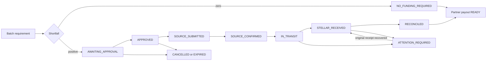

# Implementation decisions — local MVP

## ADR-001: a persisted vertical slice before a live transfer rail

PRD v1.3 has not selected an operator, source chain, canonical source token or signing integration. This delivery implements the common treasury workflow and a persistent simulator. The default asset label is USDT0, with explicitly fake `sandbox:` addresses and `sim:` evidence. These identifiers must never be submitted to an explorer or treated as chain proof. No source chain (including Base) is claimed supported by this code.

The simulator deliberately exposes successful, delayed and partial-delivery scenarios. This makes the state machine and operational controls executable before selecting a live rail. A live adapter needs a separately implemented prepare/quote, operator signing, broadcast recovery, source observation, protocol observation and validated destination receipt boundary. The simulator's atomic DB insertion does not solve exactly-once external broadcasting; that will require durable signed-transaction identity, nonce/replacement handling and chain reconciliation.

## ADR-002: local single-process storage

Node 24 `node:sqlite` uses SQLite WAL, synchronous FULL and `BEGIN IMMEDIATE` for state mutations. Funding state, source simulation, audit and outbox writes are committed together. All amounts are serialized decimal strings; arithmetic is BigInt. The DB contains local API/webhook secrets and is created with restrictive file permissions.

No multi-instance worker or database migration system is claimed. Before a hosted pilot, introduce versioned migrations, backup/restore drills, production identity/secret storage, and evaluate PostgreSQL plus worker claim/lease semantics. SQLite's experimental Node API status on Node 24 is another reason to review storage before production. [Node SQLite documentation](https://nodejs.org/docs/latest-v24.x/api/sqlite.html)

## ADR-003: balance reservation and amounts

The shortfall is `max(0, batch + reserve + existing allocations - observed balance)`. Each unsigned request reserves only the currently available contribution. Incoming unconfirmed transfers are never used as available liquidity. After receipt, its value is quarantined until reconciliation; once reconciled the full batch requirement is reserved. A payout releases its allocation and debits the account in one transaction.

Unsubmitted funding reservations count against the daily cap even across midnight. Submitted transfers count on their UTC submission day. Cancelled/expired unsubmitted requests release reservations. A hard limit is not an approval threshold.

Amounts use Stellar's seven decimal places; the candidate USDT0 path rounds required funding upward to six shared decimals. No fee is invented: this simulator has zero fees. A live quote must distinguish source debit, destination minimum receipt, transport/gas fees, allowance and quote expiry. [Stellar USDT0 precision](https://developers.stellar.org/docs/tokens/usdt0-layerzero)

## ADR-004: immutable approval and states

`FundingRequest` contains the immutable intent and mutable lifecycle. Its `intent_hash` commits to identity, batch, payout need, funding amount, source, destination, expiry and policy snapshot. Approval requires that exact hash. The current account, policy, balance freshness and funding sufficiency are checked again before submission. Increased need blocks the old request; the amount is not silently changed.

Core path:

`APPROVED` is explicit so product approval cannot be mistaken for economic submission. `NO_FUNDING_REQUIRED` and `EXPIRED` are explicit outcomes missing from the original diagram. `RECONCILED` is the funding terminal state; separate `payout_status` tracks READY/PAID. The PRD's redundant CLOSED state is not implemented in this slice. Readiness is emitted as `funding.reconciled` or `funding.not_required`.

## ADR-005: local authorization and events

Local operator session and partner bearer token have separate permissions. The operator session supports an HttpOnly cookie and an in-memory `X-Flux-Session` header for editor previews that block cookies. The bootstrap returns the session token only through the same protected local JSON endpoint with no-store caching; it is not persisted in browser storage or URLs. CSP permits local/editor frame ancestors and excludes arbitrary remote parents. The initial local bootstrap is deliberately not public authentication or MFA. Fixed source/destination configuration is the allowlist; changing it in the database invalidates an existing approval at submit time.

Audit events are append-only via SQLite triggers and hash-linked. This helps detect accidental alteration and ordinary edits, but a database owner can replace the whole database. External tamper-proof anchoring is not claimed. Webhooks are written through a transactional outbox and signed over exact timestamp plus raw JSON. Receivers must deduplicate event IDs and tolerate replay/out-of-order arrival. Only the single local dispatcher is supported.

## UI and runtime

React/TypeScript with Vite, served with the Express API on one origin. The operator interface uses English product copy for the PRD's international operator audience. Desktop and mobile layouts share the same working API. Font assets are packaged locally. The dashboard shows observed sandbox activity; baseline capital savings remain unmeasured until actual pilot data exists.
